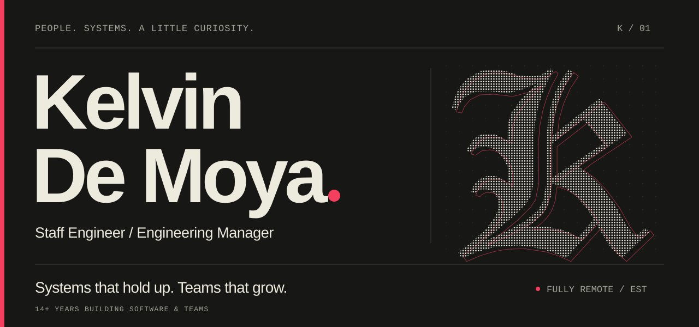

<a href="https://kdemoya.github.io/">
  <picture>
    <source media="(max-width: 600px)" srcset="./assets/hero-mobile.svg">
    
  </picture>
</a>

<p align="center">
  <a href="https://kdemoya.github.io/">Portfolio ↗</a>
  &nbsp; / &nbsp;
  <a href="https://www.linkedin.com/in/kdemoya/">LinkedIn</a>
  &nbsp; / &nbsp;
  <a href="mailto:kdemoya17@gmail.com">Say&nbsp;hello</a>
</p>

### Software, with people in mind.

I’m **Kelvin**. I build APIs, content systems, and the teams behind them. Over **14+ years**, that’s meant making search dependable, untangling permissions, connecting services, and helping engineers own bigger problems.

At **Wistia**, I grew from Senior Software Engineer II to Staff Engineer and Engineering Manager. I still work close to the code: architecture, implementation, coaching, and technical direction belong together.

### A few things I’ve helped put into the world

**01 &nbsp; / &nbsp; Search that checks itself**<br>
At Wistia, I conceived and led sampled consistency monitoring and automated repair, with account-aware indexing and a reversible migration. Make reliability something you can observe.

**02 &nbsp; / &nbsp; Private space in a shared product**<br>
I led scoping and initial implementation for Wistia’s **My Library**, carrying private-content rules through authorization, queries, search, and APIs.

**03 &nbsp; / &nbsp; Many services. One API.**<br>
For **Beachbody, through X-Team**, I architected and led a federated GraphQL gateway serving web, Android, iOS, and Roku teams, alongside a REST-to-GraphQL migration and upstream caching.

[More of the work, and the story behind it ↗](https://kdemoya.github.io/profile.html)

### How I work

> Make change observable and reversible. Give engineers room to own the work. Stay close enough to the implementation to help.

**On my workbench:** Ruby / Rails · TypeScript / Node.js · GraphQL · React · SQL · Algolia

I use **Claude Code and Codex** across research, planning, and implementation, and help other engineers adopt AI through demonstrations, coaching, and working prototypes. Architecture, review, and validation stay my responsibility.

---

<details>
<summary><b>Bring your curiosity. Or your agent.</b></summary>

My [professional context](https://kdemoya.github.io/context.md) is available as plain Markdown. Give your agent this prompt:

```text
Read https://kdemoya.github.io/context.md.
Tell me about Kelvin De Moya's work and engineering approach.
Use concrete examples and distinguish evidence from inference.
```

</details>

<p align="right"><sub>People. Systems. A little curiosity.</sub></p>
